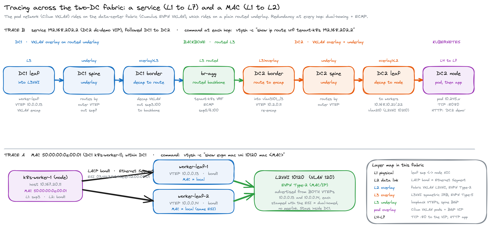

# Tracing a MAC or a service across the fabric: a per-device, L1 to L7 walk

Follow traffic through the ecloud two-DC fabric **device by device**. At each device you
see everything that device does with the packet: the physical/L2, the fabric **overlay**
(VXLAN VNI + VTEP), the **underlay** it rides on, the **L3 routing** (VRF), and the EVPN/BGP
**control plane** that put the route there. Every command is shown with the real device
prompt (so you can see where it was captured), followed by its live output and a plain
explanation. Two examples: a **MAC** (stays in one DC, L1 to L2) and a **service** (crosses
both DCs, L1 to L7). Captured live 2026-08-15.



## For executives
A request travels down the stack on one server, across a layered network, and up the stack
on a server in the other DC. The Kubernetes pod network rides on the data-center fabric,
which rides on a plain routed core. Everything is doubled (dual-homing + ECMP), so no single
wire or box is in the path. Below, we open each box along the way.

## The layers, and the two overlays
| Layer | What carries it here |
|---|---|
| L1 physical | leaf `swpN` to server NIC (bonded / LACP) |
| L2 data link | LACP bond = EVPN **Ethernet Segment (ESI)**, a VLAN |
| L2 overlay (fabric) | Cumulus VXLAN **L2VNI**, EVPN **Type-2** |
| L3 overlay (fabric) | **L3VNI** (symmetric IRB), EVPN **Type-5** |
| L3 underlay | loopback **VTEPs**, spine BGP (transport the overlay rides on) |
| pod overlay (k8s) | **Cilium VXLAN** (pods 10.245.x), Cilium BGP advertising the VIP |
| L4 to L7 | TCP:80 to the service VIP, the HTTP app |

Two overlays are stacked: the Cilium pod network (`routing-mode: tunnel`) rides on the
Cumulus fabric VXLAN, which rides on the routed underlay. VRF: `tenant-k8s`.
DC1: L2VNI 10120 / L3VNI 50001 / VTEPs 10.0.0.x. DC2: L2VNI 10210 / L3VNI 50101 / VTEPs 10.2.0.x.

---

# Trace A: a MAC (L1 to L2), within DC1

Target `50:00:00:0e:00:01` = the data0 NIC of DC1 **k8s-worker-1** (host 10.167.20.11),
dual-homed to the worker-leaf pair by EVPN Multihoming.

## Device: leaf-k8s-worker-1 (VTEP 10.0.0.13) — the leaf the host attaches to

**L1 physical + L2 bond**
```
cumulus@leaf-k8s-worker-1:mgmt:~$ grep -E "Slave Interface|MII Status|Aggregator ID" /proc/net/bonding/bond1
MII Status: up
Slave Interface: swp3
MII Status: up
Aggregator ID: 1
cumulus@leaf-k8s-worker-1:mgmt:~$
```
Host on leaf port `swp3` (L1), member of `bond1` (L2, LACP 802.3ad). Under EVPN-MH the bond
is an Ethernet Segment; the leaf presents the ES system MAC `44:38:39:be:ef:12` as its LACP
system-id, so the host bonds to both leaves as one.

**L2 overlay — the MAC in L2VNI 10120**
```
cumulus@leaf-k8s-worker-1:mgmt:~$ sudo vtysh -c "show evpn mac vni 10120 mac 50:00:00:0e:00:01"
MAC: 50:00:00:0e:00:01
 ESI: 03:44:38:39:be:ef:12:00:00:01
 Intf: bond1(23) VLAN: 120
 Sync-info: neigh#: 2 peer-active
 Local Seq: 0 Remote Seq: 0
 Uptime: 01:44:21
 Neighbors:
    10.167.20.11 Active
cumulus@leaf-k8s-worker-1:mgmt:~$
```
Local on bond1, VLAN 120 (L2VNI 10120), Ethernet Segment `03:44:38:39:be:ef:12:00:00:01`,
`peer-active` (synced with the ES peer over EVPN, no peerlink), host IP 10.167.20.11.

**Fabric VXLAN encapsulation**
```
cumulus@leaf-k8s-worker-1:mgmt:~$ ip -d link show vxlan48
    vxlan external ... local 10.0.0.13 ... dstport 4789 ... neigh_suppress on
cumulus@leaf-k8s-worker-1:mgmt:~$
```
L2VNI 10120 rides `vxlan48`, sourced from this leaf's VTEP 10.0.0.13, UDP 4789, ARP suppression on.

**Control plane — EVPN Type-2, from BOTH VTEPs**
```
cumulus@leaf-k8s-worker-1:mgmt:~$ sudo vtysh -c "show bgp l2vpn evpn route type macip" | grep -A2 0e:00:01
*> [2]:[0]:[48]:[50:00:00:0e:00:01]:[32]:[10.167.20.11] RD 10.0.0.13:2
      ESI:03:44:38:39:be:ef:12:00:00:01  RT:65000:10120 RT:65112:50001 Rmac:50:00:00:05:00:11
*> [2]:[0]:[48]:[50:00:00:0e:00:01] RD 10.0.0.14:2   (leaf-k8s-worker-2)
cumulus@leaf-k8s-worker-1:mgmt:~$
```
MAC-only Type-2 (L2, `RT:65000:10120`) and MAC+IP Type-2 (adds the host IP, the L3VNI target
`RT:65112:50001`, and the router-mac for symmetric IRB). Advertised from both ES VTEPs
(10.0.0.13 and 10.0.0.14), each stamped with the ESI, so a remote leaf ECMPs to both.

## Device: leaf-k8s-worker-2 (VTEP 10.0.0.14) — the ES peer
```
cumulus@leaf-k8s-worker-2:mgmt:~$ sudo vtysh -c "show evpn mac vni 10120 mac 50:00:00:0e:00:01"
MAC: 50:00:00:0e:00:01
 ESI: 03:44:38:39:be:ef:12:00:00:01
 Intf: bond1(22) VLAN: 120
 Sync-info: neigh#: 2 peer-active
cumulus@leaf-k8s-worker-2:mgmt:~$
```
Same MAC, same ESI, local on the peer's own bond1: the multihoming. This MAC never leaves DC1
(L2VNI 10120 is only on this pair). To follow the host across DCs, trace its IP as a service.

---

# Trace B: a service (L1 to L7), DC1 to DC2 — one device at a time

Target `192.168.202.2` = the DC2 dc-demo LoadBalancer VIP. We open every device the packet
crosses. Same lookup command at each L3 hop, plus the overlay/underlay/control-plane state
that explains what the device does.

## Where the service comes from (Kubernetes, the top of the stack)
k8s commands run from the operator workstation via the tunnel; `kd2` = `kubectl --context dc2`.
```
you@ops:~$ curl http://192.168.202.2/               -> "DC2 demo"  (HTTP 200)
you@ops:~$ kd2 -n demo get svc dc-demo-dc2 -o wide
  dc-demo-dc2  LoadBalancer  192.168.202.2  80:32077/TCP  app=dc-demo
you@ops:~$ kd2 -n demo get endpoints dc-demo-dc2
  10.245.1.47:8080, 10.245.3.240:8080
you@ops:~$ kd2 -n demo get pods -l app=dc-demo -o wide
  ...tv62r  10.245.1.47   dc2-k8s-worker-3   (node 10.168.10.23)
  ...n9fgm  10.245.3.240  dc2-k8s-worker-2   (node 10.168.10.22)
you@ops:~$ kd2 -n kube-system get cm cilium-config -o jsonpath='{.data.routing-mode} bgp={.data.enable-bgp-control-plane}'
  tunnel bgp=true          (svc externalTrafficPolicy: Local)
```
The VIP is backed by two pods on `dc2-k8s-worker-2/-3`. Cilium (routing-mode tunnel, BGP
control-plane, ext-Local) advertises the VIP into the fabric **from the nodes running the
pods**, so the fabric next-hops for the VIP are exactly those workers. That advertisement,
carried across the fabric as EVPN Type-5, is what every device below is forwarding on.

## Device 1: dc1 leaf-k8s-worker-1 (VTEP 10.0.0.13) — L3 lookup, VXLAN encap
Packet in (from the host/upstream) -> L3 lookup in tenant-k8s -> VXLAN-encap into the L3VNI -> out to a DC1 border VTEP.

**L3 routing (VRF tenant-k8s)**
```
cumulus@leaf-k8s-worker-1:mgmt:~$ sudo vtysh -c "show ip route vrf tenant-k8s 192.168.202.2"
  * 10.0.0.17, via vlan3001_l3 onlink, weight 1      # leaf-border-1 VTEP
  * 10.0.0.18, via vlan3001_l3 onlink, weight 1      # leaf-border-2 VTEP (ECMP)
cumulus@leaf-k8s-worker-1:mgmt:~$
```
Remote service, resolved through the L3VNI SVI `vlan3001_l3` to the DC1 border VTEPs.

**Overlay (L3VNI 50001, symmetric IRB)**
```
cumulus@leaf-k8s-worker-1:mgmt:~$ sudo vtysh -c "show evpn vni 50001"
VNI: 50001   Type: L3   Tenant VRF: tenant-k8s
  Local Vtep Ip: 10.0.0.13   Router MAC: 50:00:00:05:00:11
  Vxlan-Intf: vxlan99   SVI-If: vlan3001_l3   L2 VNIs: 10120
cumulus@leaf-k8s-worker-1:mgmt:~$
```
This leaf's VTEP is 10.0.0.13; it routes into L3VNI 50001 via `vxlan99`.

**Control plane (EVPN Type-5 — where the route came from)**
```
cumulus@leaf-k8s-worker-1:mgmt:~$ sudo vtysh -c "show bgp l2vpn evpn route type prefix" | grep -A3 '192.168.202.2]'
*> [5]:[0]:[32]:[192.168.202.2] RD 10.0.0.17:4
      10.0.0.17                0 65100 65114 65400 65213 65200 65211 65020 i
      RT:65114:50001 RT:65211:50101 ET:8 Rmac:50:00:00:09:00:11
cumulus@leaf-k8s-worker-1:mgmt:~$
```
The service is an EVPN **Type-5** route, originated by the DC1 border (RD 10.0.0.17:4,
next-hop VTEP 10.0.0.17), carrying the border's router-mac `50:00:00:09:00:11` (the inner
destination MAC the leaf encapsulates with). The **AS-path is the whole fabric**: 65100
(dc1 spine) 65114 (dc1 border) 65400 (backbone) 65213 (dc2 border) 65200 (dc2 spine) 65211
(dc2 leaf) 65020 (dc2 nodes). One BGP route, the entire two-DC journey.

**Underlay (reach the border VTEP)**
```
cumulus@leaf-k8s-worker-1:mgmt:~$ sudo vtysh -c "show ip route 10.0.0.17"
  * fe80::5200:ff:fe01:3, via swp1, weight 1         # spine-1
  * fe80::5200:ff:fe02:3, via swp2, weight 1         # spine-2 (ECMP)
cumulus@leaf-k8s-worker-1:mgmt:~$
```
The VXLAN packet (outer dst = border VTEP 10.0.0.17) is carried in the underlay via both spines.
**Out:** VXLAN, outer 10.0.0.13 -> 10.0.0.17, inner dst-mac = 50:00:00:09:00:11.

## Device 2: dc1 spine-1 — pure underlay + EVPN route-reflector
Packet in (VXLAN) -> route by the OUTER VTEP -> out to the border. The spine never decapsulates.

**Underlay**
```
cumulus@spine-1:mgmt:~$ sudo vtysh -c "show ip route 10.0.0.17"
  * fe80::5200:ff:fe09:1, via swp7, weight 1
cumulus@spine-1:mgmt:~$
```
Routes the tunnel by its outer VTEP (10.0.0.17) out swp7. **Control plane:** the spine is
the EVPN route-reflector; it reflected the Type-5 above between the border and the leaves. It
has no VTEP and no VNI of its own.

## Device 3: dc1 leaf-border-1 (VTEP 10.0.0.17) — overlay meets the routed backbone
Packet in (VXLAN) -> decapsulate (this is the destination VTEP for the intra-DC1 hop) -> L3 route out a plain per-VRF link to the backbone.

**Overlay (L3VNI 50001, this border's VTEP)**
```
cumulus@leaf-border-1:mgmt:~$ sudo vtysh -c "show evpn vni 50001"
VNI: 50001   Type: L3   Tenant VRF: tenant-k8s
  Local Vtep Ip: 10.0.0.17   Router MAC: 50:00:00:09:00:11
cumulus@leaf-border-1:mgmt:~$
```
This border's VTEP is 10.0.0.17, router-mac 50:00:00:09:00:11 (the one the leaf encapsulated to).

**L3 routing (VRF tenant-k8s) — out to the backbone, no VXLAN**
```
cumulus@leaf-border-1:mgmt:~$ sudo vtysh -c "show ip route vrf tenant-k8s 192.168.202.2"
  * fe80::5200:ff:fe24:1, via swp3.100, weight 1
cumulus@leaf-border-1:mgmt:~$
```
Decapsulated, the service is routed out `swp3.100`, a plain routed per-VRF subinterface into
the br-agg backbone. **Control plane:** this border learned the service from the backbone
(routed BGP) and re-originated it into DC1 EVPN as the Type-5 the leaf saw.
**Out:** plain L3 (no VXLAN), tagged VLAN 100 = tenant-k8s, to br-agg.

## Device 4: br-agg-sw-1 — the routed backbone (east-west, no VXLAN)
Packet in (routed, per-VRF) -> L3 lookup in tenant-k8s -> out to a DC2 border.
```
cumulus@br-agg-sw-1:mgmt:~$ sudo vtysh -c "show ip route vrf tenant-k8s 192.168.202.2"
  * fe80::5200:ff:fe1d:3, via swp5.100, weight 1     # dc2-border-1
  * fe80::5200:ff:fe1e:3, via swp6.100, weight 1     # dc2-border-2 (ECMP)
cumulus@br-agg-sw-1:mgmt:~$
```
Plain L3, VRF-per-tenant, ECMP to both DC2 borders. No overlay, no underlay, no firewall: this
is the routed core. (Key-only login: `sudo` needs the password entered at its prompt.)

## Device 5: dc2-border-1 (VTEP 10.2.0.15) — routed backbone meets the DC2 overlay
Packet in (routed) -> L3 route -> VXLAN-encap into the DC2 L3VNI -> out to the DC2 leaf VTEP.

**L3 routing (VRF tenant-k8s) — into the DC2 overlay**
```
cumulus@dc2-border-1:mgmt:~$ sudo vtysh -c "show ip route vrf tenant-k8s 192.168.202.2"
  * 10.2.0.11, via vlan3101_l3 onlink, weight 1
cumulus@dc2-border-1:mgmt:~$
```
Routes it into the DC2 L3VNI SVI `vlan3101_l3` toward VTEP 10.2.0.11 (dc2-k8s-leaf-1).

**Overlay (L3VNI 50101, this border's VTEP)**
```
cumulus@dc2-border-1:mgmt:~$ sudo vtysh -c "show evpn vni 50101"
VNI: 50101   Type: L3   Tenant VRF: tenant-k8s
  Local Vtep Ip: 10.2.0.15   Router MAC: 50:00:00:1d:00:10
cumulus@dc2-border-1:mgmt:~$
```
This DC2 border's VTEP is 10.2.0.15. **Out:** VXLAN, outer 10.2.0.15 -> 10.2.0.11.

## Device 6: dc2-spine-1 — pure underlay
Routes the tunnel by the outer VTEP 10.2.0.11 to the DC2 leaf; EVPN RR for DC2. Same role as device 2.

## Device 7: dc2-k8s-leaf-1 (VTEP 10.2.0.11) — overlay meets L2, deliver to the node
Packet in (VXLAN) -> decapsulate (destination VTEP) -> L3 -> L2 on vlan210 -> to the worker node.

**Overlay (L3VNI 50101 + its L2VNI)**
```
cumulus@dc2-k8s-leaf-1:mgmt:~$ sudo vtysh -c "show evpn vni 50101"
VNI: 50101   Type: L3   Tenant VRF: tenant-k8s
  Local Vtep Ip: 10.2.0.11   Router MAC: 50:00:00:19:00:10   L2 VNIs: 10210
cumulus@dc2-k8s-leaf-1:mgmt:~$
```
This leaf's VTEP is 10.2.0.11 (the one the border encapsulated to); its tenant L2VNI is 10210 (VLAN 210).

**L3 routing (VRF tenant-k8s) — to the pod-bearing workers**
```
cumulus@dc2-k8s-leaf-1:mgmt:~$ sudo vtysh -c "show ip route vrf tenant-k8s 192.168.202.2"
  * 10.168.10.22, via vlan210, weight 1
  * 10.168.10.23, via vlan210, weight 1
cumulus@dc2-k8s-leaf-1:mgmt:~$
```
Delivered to the local workers 10.168.10.22 / .23 on `vlan210` (L2VNI 10210) — exactly the
nodes running the pods (externalTrafficPolicy Local). The subnet is directly connected here,
so the final hop is L2 (ARP/ND for the node MAC on VLAN 210). **Out:** an L2 frame to the node.

## Device 8: dc2-k8s-worker-2/-3 (node) + Kubernetes (L4 to L7)
The node receives the packet for `192.168.202.2:80`. kube-proxy / Cilium DNATs it to a backing
pod (`10.245.1.47:8080` or `10.245.3.240:8080`) over the **Cilium pod overlay** (a second
VXLAN, pods 10.245.x). The pod's HTTP handler answers; `curl` sees `DC2 demo`. The reply
retraces the whole path in reverse.

## The path, one line per hop
`dc1 leaf (L3 lookup, VXLAN encap) -> dc1 spine (underlay) -> dc1 border (decap, routed) ->
br-agg (routed backbone, ECMP) -> dc2 border (routed, VXLAN encap) -> dc2 spine (underlay) ->
dc2 leaf (decap, L2) -> dc2 node -> Cilium -> pod -> app`.

## Gotchas
- **Backbone sudo needs the password** (key-only login): `echo <pw> | sudo -S vtysh -c "..."`, or FRR returns empty.
- **A MAC never crosses DCs;** trace a host across DCs by its IP (as a service).
- **Two overlays:** a pod-to-pod cross-DC packet is encapsulated by Cilium *and* the fabric.
- **Dual-homed MACs appear twice in BGP,** once per ES VTEP, both carrying the ESI.
- **Pod placement is dynamic;** the VIP's fabric next-hops (device 7) always match the current
  pod nodes, because `externalTrafficPolicy: Local`.
