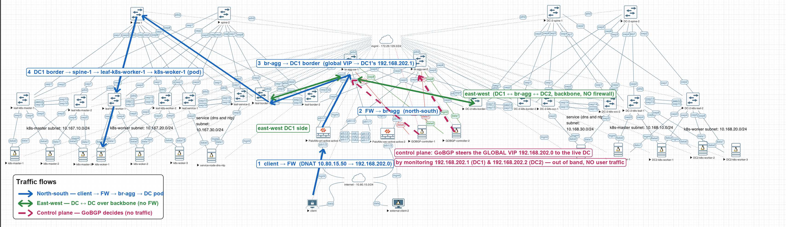

# ecloud: a two-DC EVPN-VXLAN datacenter in containerlab, fully self-bootstrapping

A faithful containerlab replica of the ecloud POC: **two EVPN-VXLAN datacenters
(Cumulus Linux 5.12), a routed backbone, a Palo Alto Active/Active firewall pair,
two k3s+Cilium Kubernetes clusters, a host-based GoBGP anycast controller, lab DNS,
and external clients**. 39 nodes, 75 links, one command.

Everything configures itself on `clab deploy`. Cold-deploy proven: from
`clab destroy --cleanup` to a working end-to-end demo (external client curls the
anycast VIP by DNS name and lands in the GoBGP-steered DC through the firewalls)
in ~20 hands-off minutes.



## What you get

| Layer | Nodes | Self-bootstrap mechanism | Ready in |
|---|---|---|---|
| Fabric | 20x Cumulus VX 5.12 (2 DCs: spines, EVPN-MH leaf pairs, borders; 2 backbone aggr) | `startup-config` nv-set replay by a patched vrnetlab launcher; EVPN-MH leaves self-reboot + `evpn mh redirect-off` | ~4 min converged |
| Firewalls | 2x PA-VM 12.1.2 Active/Active | full `<config>` XML loaded via the API by a patched launcher (2-phase: jumbo-frame + reboot, then load + commit) | ~19 min |
| Kubernetes | DC1: 3 masters + 3 workers. DC2: 1 master + 3 workers (k3s 1.31.5, Cilium 1.16.5, airgap) | custom `ecloud-k8s-host` image: PID-1 cgroup-v2 entrypoint builds the LACP bond, launches k3s; the init master installs Cilium + BGP + the demo app + all VIPs | ~12 min both DCs Ready |
| Anycast control | 2x GoBGP nodes (active/standby, AS 65400 iBGP to the backbone) | bootstrap script installs gobgpd + a Python "brain" that health-checks both DCs and steers each VIP | ~1 min |
| Services | DNS (dnsmasq, `ecloud.lab` zone) + NTP on the svc nodes | bootstrap script + bind-mounted zone config | seconds |
| Clients | 2 external clients on the "internet" segment | bootstrap script (IP, route, DNS via the firewall DNAT) | seconds |

The demo: `192.168.202.0` is a **global anycast VIP** served by both DCs.
The GoBGP brain re-originates it (and two per-client VIPs, `.202.3` / `.202.4`)
with next-hop = the chosen DC's regional VIP, decided by live HTTP health +
per-VIP policy (failover / latency with hysteresis / static). External clients
reach it through the PA pair's DNAT (`10.80.15.50` and friends), or by name
(`app.ecloud.lab`, `dc1.…`, `dc2.…`) via the lab DNS.

The app behind the VIPs is the full ecloud demo (namespace `demo`): a per-DC
themed UI with a region picker, `/docs` (the complete POC design document),
a **cross-region consumer** that fetches the peer DC's dataset over the backbone
via NodePort 30080 (`/api/consume?region=DC2`), and a **live traceroute path map**
(`/api/trace?region=…`) that shows the actual hop-by-hop east-west path:
pod, leaf SVI, border, backbone aggr, peer leaf, peer node. Its code + docs live
in a ConfigMap that cluster-bootstrap builds with create/replace (never `apply`:
docs.html is >256KB and overflows the last-applied annotation).

The whole suite has been **failover-drilled** (pod, anycast steering, host link,
EVPN-MH leaf, backbone aggr, firewall): see
[docs/FAILOVER-DRILLS.md](docs/FAILOVER-DRILLS.md) for methodology, per-drill
loss numbers, and the A/A firewall grey-failure finding.

## Requirements

- A Linux host with **bare-metal KVM** (`/dev/kvm`), ~48 vCPU / ~128 GB RAM
  comfortable (each Cumulus VX is a 2 vCPU / 4 GB VM; each PA-VM runs 8 vCPU / 16 GB).
  Reference host: 96 cores / 314 GB.
- docker, containerlab (built on 0.78.2), git, curl, zstd, python3, sshpass.
- A [vrnetlab](https://github.com/hellt/vrnetlab) checkout (2025-07 or later: needs `nvidia/cumulus-vx`).
- **Two VM images you must supply** (licensed, not distributed here, gitignored):
  - `cumulus-linux-5.12.0-vx-amd64-qemu.qcow2` — NVIDIA no longer distributes VX; you need an existing copy.
  - `PA-VM-KVM-12.1.2.qcow2` — from your Palo Alto support account.

## Quick start

```bash
git clone <this repo> ecloud && cd ecloud
mkdir images   # put the two qcow2s here
```

**1) Host prerequisites (once):**

```bash
# bonding module (the k8s hosts build 802.3ad bonds)
echo bonding | sudo tee /etc/modules-load.d/clab-bonding.conf && sudo modprobe bonding
# the shared "internet" segment: clab's bridge kind attaches to an EXISTING host bridge
sudo cp host-services/clab-internet-bridge.service /etc/systemd/system/
sudo systemctl daemon-reload && sudo systemctl enable --now clab-internet-bridge
```

Two host-specific caveats to check:
- If your docker runs with `"iptables": false`, containers have no egress; add MASQUERADE
  rules for the docker/clab subnets (only the *builds* need internet; the lab itself is airgapped).
- If `172.29.129.0/24` (the lab mgmt subnet) collides with something on your host, you have
  two options. A *routing* collision (VPN, Tailscale subnet route) is fixed by pinning it local:
  `ip rule add to 172.29.129.0/24 lookup main priority 5100`. A *local bridge* collision (e.g.
  running on an EVE-NG box, whose `nat0` cloud IS 172.29.129.0/24) is handled automatically:
  `build_clab.py` checks the host's local interfaces and moves to the next free /24 (172.29.140
  first) by itself. Every mgmt IP keeps its last octet, so `.11` is still spine-1; the chosen
  subnet is printed when you regenerate. To force one: `CLAB_MGMT_PREFIX=x.y.z`, or drop the
  prefix into a `.mgmt-prefix` file next to the script.

**2) Patch vrnetlab + build the VM images (~15 min):**

The stock launchers cannot bootstrap these NOS versions. The patches in this repo fix that
(details in the launcher-patches section below):

```bash
python3 cvx_startup_config.patch.py /root/containerlab/vrnetlab/nvidia/cumulus-vx/docker/launch.py
python3 pan_panos12.patch.py       /root/containerlab/vrnetlab/paloalto/pan/docker/launch.py
VR=/root/containerlab/vrnetlab ./build_images.sh   # also fetches the GoBGP binaries
```

**3) Build the k8s host image (~5 min, needs internet):**

```bash
k8s/build-k8s-image.sh    # downloads k3s + airgap images + Cilium, builds ecloud-k8s-host:1.31.5
```

**4) Deploy. That's it:**

```bash
sudo containerlab deploy -t ecloud.clab.yml
```

Nothing to push, nothing to configure. Optional: install the ES-bond watchdog
(`host-services/`, see below) for long-running labs.

## Verify

```bash
# fabric: all 8 leaf uplinks Established on a spine (~4 min after deploy)
docker exec clab-ecloud-spine-1 sshpass -p 'Clab123!' ssh cumulus@127.0.0.1 \
  'sudo vtysh -c "show bgp l2vpn evpn summary"'

# k8s: DC1 6 Ready, DC2 4 Ready (~12 min)
ssh admin@clab-ecloud-k8s-master-1        # password: admin, then: kubectl get nodes

# GoBGP brain: health + per-VIP steering decisions
docker exec clab-ecloud-gobgp-1 cat /run/gobgp-brain-status.json

# the money shot (~20 min, once the firewalls are healthy):
docker exec clab-ecloud-client-1 curl http://app.ecloud.lab/api/whoami   # -> DC1 pod identity
docker exec clab-ecloud-client-1 curl http://dc2.ecloud.lab/api/whoami   # -> DC2 pod identity
docker exec clab-ecloud-client-1 curl http://10.80.15.54/api/whoami      # -> DC2 (static per-client steering)
# rich-app extras: the docs page, the cross-region consumer, the live path trace
docker exec clab-ecloud-client-1 curl -o /dev/null -w '%{size_download}\n' http://10.80.15.50/docs   # ~464 KB
docker exec clab-ecloud-client-1 curl 'http://10.80.15.51/api/consume?region=DC2'  # DC1 pod fetches DC2 over the backbone
docker exec clab-ecloud-client-1 curl 'http://10.80.15.51/api/trace?region=DC2'    # hop-by-hop east-west path
```

## Access

| What | How | Credentials |
|---|---|---|
| Cumulus switches | `ssh cumulus@<mgmt-ip>` or `docker exec <c> sshpass -p 'Clab123!' ssh cumulus@127.0.0.1` | `cumulus` / `Clab123!` (also `admin` / `admin`, the VSCode extension's default) |
| Hosts, k8s nodes, clients, gobgp | `ssh admin@clab-ecloud-<name>` | `admin` / `admin` (also `user` and `root` / `Test123`) |
| kubectl | on any master, as any user | preconfigured (`KUBECONFIG` + symlink) |
| PA-VM | HTTPS/XML-API on its mgmt IP | `admin` / `Admin@123` |
| GoBGP | `docker exec clab-ecloud-gobgp-1 gobgp global rib` | - |

**Passwordless SSH**: run `host-services/push-ssh-keys.sh` once. It installs the host's
ed25519 key on every running device AND stages it into `bootstrap/hosts/authorized_keys`,
which every later deploy installs at first boot (hosts via the bind mount, switches via
the patched launcher, firewalls folded into the config commit).

Mgmt IPs are static (`172.29.129.11-.48`, mapped in `ecloud.clab.yml`); clab also writes
`/etc/hosts` entries so container names resolve from the host.

## Repo layout

```
ecloud.clab.yml            the topology (GENERATED: edit build_clab.py / hosts.py, then regenerate)
build_clab.py              generator; holds the authoritative link map (84 links captured from the
                           original EVE-NG lab, none inferred) + name/interface mapping
hosts.py                   generator for every host's first-boot script + the DNS zone
bootstrap/                 what the lab boots from:
  <switch>.cfg               per-switch nv-set config (filtered live captures)
  fw-pri.xml, fw-sec.xml     full PAN <config> XML (sanitized: no users/certs/secrets)
  hosts/<host>.sh            per-host first-boot scripts (bond/IP/route/SSH/daemons)
  hosts/gobgp/               gobgpd.conf + brain.json per node, controller_brain.py (binaries fetched)
  hosts/svc/                 dnsmasq zone + host records
k8s/                       the ecloud-k8s-host image: Dockerfile, PID-1 entrypoint,
                           cluster-bootstrap (Cilium+BGP+app+VIPs), manifests, asset fetcher
cvx_startup_config.patch.py  \  vrnetlab launcher patches (apply to a pristine checkout;
pan_panos12.patch.py         /  *.patched = the resulting launchers, for reference)
pan_xml_extract.py         builds a loadable sanitized XML from a live PAN (op-mode show config running)
host-services/             internet-bridge unit + the ES-bond flap watchdog (see its README)
push_configs.sh            manual fallback only; the launcher path makes it unnecessary
configs/                   raw nv config captures the bootstrap configs were filtered from (reference)
ecloud-fabric.clab.yml     fabric-only subset (20 switches, no hosts/FWs), for quick fabric work
```

## How the tricky parts work

**Cumulus VX under containerlab** (`nvidia_cumulusvx` kind = VX as a QEMU VM in a
container, via vrnetlab). The stock launcher does not apply `startup-config` at all, and
has a bug where no VX node ever reports healthy (`_switchd_is_ready` compares a str to
bytes). `cvx_startup_config.patch.py` fixes both, replays the nv-set config over SSH once
switchd is up, and for EVPN-MH leaves does the required one-time reboot +
`evpn mh redirect-off`. It also handles reused overlay disks (stock wedges on the factory
password) which makes single-node recreation safe.

**PAN-OS 12 under vrnetlab**: needs `QEMU_CPU: host` (PAN-OS 12 requires x86-64-v2;
clab hard-codes qemu64) and 8 vCPU / 16 GB (at vrnetlab's 2/6 it boots into the recovery
tool) — both set per-node in the topology. Set-format config replay fails silently
(dependency order), so the launcher imports a full sanitized `<config>` XML via the API:
phase 1 enables jumbo-frame mode + reboots (an operational toggle; the API restart is a
no-op on PAN-OS 12, so it uses QEMU system_reset), phase 2 waits for the auto-commit,
loads per-section partial merges, validates, commits.

**Kubernetes in a privileged container** (the kind/k3d problem): the `ecloud-k8s-host`
image's PID-1 entrypoint evacuates the cgroup-v2 root into `init.scope` and delegates
controllers before launching k3s (`--snapshotter=native`, no flannel/kube-proxy/servicelb).
Everything is airgapped: the nodes' default route points into the fabric, deliberately, so
all images ship inside the host image. The entrypoint also removes docker's eth0 mgmt
default route (else cross-subnet replies leak out the wrong interface and blackhole) and
is hardened to never exit (a PID-1 exit makes docker recreate the netns and the clab-wired
interfaces are gone until redeploy).

**GoBGP controller**: gobgpd speaks iBGP to both backbone switches with an
export-anycast-only policy; the brain injects each VIP with next-hop = the winning DC's
regional VIP, which the backbone resolves recursively. The backbone side carries a
deny-anycast-out filter toward the DCs to prevent re-advertisement loops. One subtlety:
gobgpd does not program the kernel FIB, so the bootstrap adds a static fabric route for
the VIP range (else the brain's health checks would follow the mgmt default and blackhole).

## Known behaviors (Cumulus VX, not this lab)

- EVPN-MH ES bonds converge only after the leaf's post-config reboot; LACP takes 2-3 min.
- Occasionally an ES bond gets stuck carrier-down; only a leaf reboot recovers it.
  `host-services/es-bond-watchdog` detects the flap signature (one bond down while
  siblings are up) and reboots that leaf, with grace + cooldown. Zero false positives
  across cold deploys in testing.
- Recreating one VM node makes clab recreate its link-peers (no hot-plug), and a
  partially reconciled deploy can leave broken veths. For anything beyond a single
  access leaf, prefer a clean `clab destroy --cleanup && clab deploy` (the lab's
  ~20 min hands-off rebuild makes this cheap).
- A node's overlay qcow2 persists in the labdir across `docker rm`; delete the labdir
  (`clab-ecloud/`) for a true clean slate.

## Credits

Built on [containerlab](https://containerlab.dev) and [hellt/vrnetlab](https://github.com/hellt/vrnetlab)
(launcher patches in this repo), [k3s](https://k3s.io), [Cilium](https://cilium.io),
[GoBGP](https://github.com/osrg/gobgp), dnsmasq. The topology replicates a physical-style
EVE-NG POC (EVPN-VXLAN multihoming per NVIDIA's Cumulus reference design).
